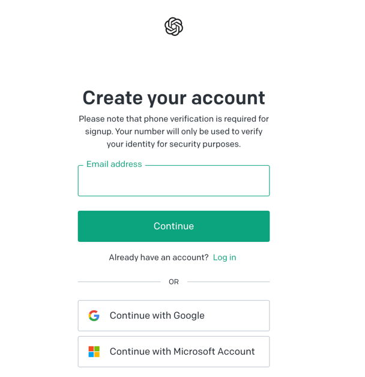
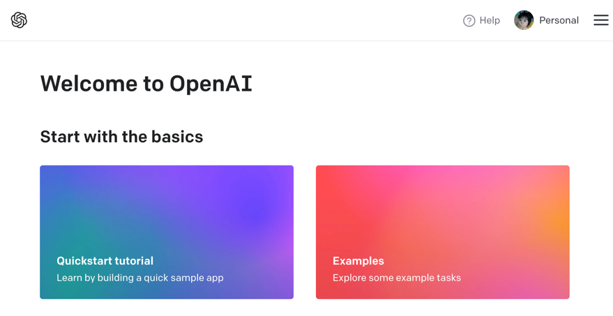
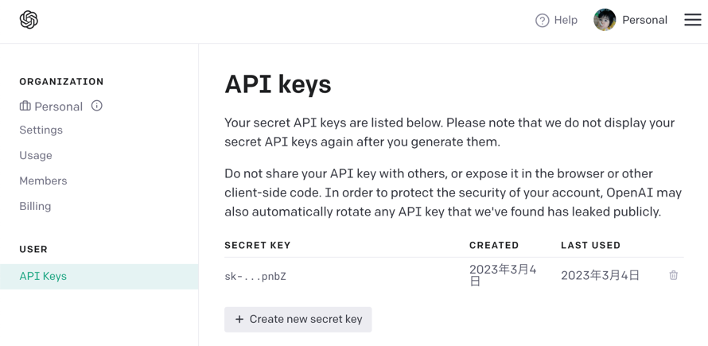

# OpenAI のAPIキー取得方法

## 1.

https://openai.com/product を開いて「Get started」をクリックする。

## 2.

ログインする。またはアカウントを作成する。作成する場合はメールアドレスと電話番号が必要です。

## 3.

無事、ログインすると紹介ページが表示される。

## 4.

自分のアイコン画像を右クリックするとリストが表示されるので、その中から「View API Keys」をクリックする。

## 5.

「Create new secret key」をクリックしてキーを作成する。
作成したキーはコピーして環境変数などに設定する。
※この設定画面からはもう一度見ることはできない。分からなくなった場合は新規にキーを生成し直すこと。

